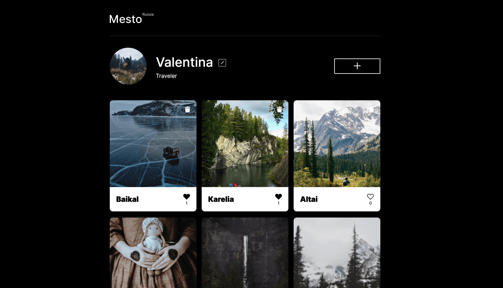

# Проект: Mesto

## Страница пользователя c фотографиями из жизни и путешествий.

#### Пользователь может редактировать свои данные, добавлять новые фото и удалять их, ставить лайки и получать лайки от других

### [Посмотреть проект Mesto](https://vlesovaya.github.io/mesto-project/)

### Используемые технологии:

#### HTML5
#### CSS3:
- [BEM](https://ru.bem.info/methodology/quick-start/#%D0%B2%D0%B2%D0%B5%D0%B4%D0%B5%D0%BD%D0%B8%D0%B5)
- Flex
- Grid
- Формы
- Медиа запросы
#### JS:
- Валидация форм
- Настройка Webpack
- Разбиение кода на модули
- Подключение к серверу
